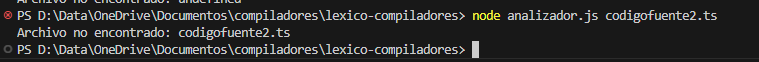

# Explicación del Código Paso a Paso

| Paso | Descripción | Función o Método Implementado | Fragmento de Código | Captura / Resultado | Observaciones |
|------|-------------|-------------------------------|----------------------|----------------------|---------------|
| 1 | Se importa el módulo `fs` para trabajar con archivos. | `require('fs')` | `const fs = require('fs');` | - | Es necesario para leer el archivo fuente. |
| 2 | Se intenta importar `cli-table3` para mostrar tablas bonitas. Si falla, se usa tabla básica. | `require('cli-table3')` con `try/catch` | `let Table; let tieneCliTable = true; try { Table = require('cli-table3'); } catch (e) { ... }` | Advertencia en consola si no está instalado. | Permite flexibilidad y mejora la presentación. |
| 3 | Se recibe el nombre del archivo fuente desde los argumentos de la terminal. | `process.argv[2]` | `const archivo = process.argv[2];` | Recibe por ejemplo: `codigofuente.ts` | Si no se pasa o no existe, lanza error. |
| 4 | Validación de existencia del archivo fuente. | `fs.existsSync` | `if (!fs.existsSync(archivo)) { ... }` | Error: "Archivo no encontrado"      | Asegura que el archivo exista antes de continuar. |
| 5 | Se lee el archivo fuente y se divide en líneas. | `fs.readFileSync`, `split('\n')` | `const code = fs.readFileSync(archivo, 'utf-8'); const lines = code.split('\n');` | Arreglo de líneas de código. | Fundamental para recorrer el código línea por línea. |
| 6 | Definición de palabras clave, tipos, operadores y delimitadores | Arrays | ```js const keywords = ['let', 'const', 'var', 'function', 'interface', 'enum', 'return', 'throw', 'if', 'else', 'typeof']; const types = ['number', 'string', 'boolean', 'void', 'any', 'unknown', 'never']; const operators = ['=', '==', '===', '!=', '!==', '<', '>', '<=', '>=', '+', '-', '*', '/', '%', '&&', '||', '!', ':', '=>', '.']; const delimiters = [';', ',', '(', ')', '{', '}', '[', ']']; ``` | Utilizado para clasificar tokens |
| 7 | Tokenización con expresión regular | `RegExp.match()` | ```js
const regex = /"(.*?)"|'(.*?)'|[A-Za-z_][\w]*|\d+\.\d+|\d+|==|===|!=|!==|<=|>=|=>|[+\-*/%=!<>&|.:;,()[\]{}]/g;
const matches = line.match(regex);
``` | Extrae los tokens crudos de una línea |
| 8 | Clasificación de tokens | Condicionales `if` | ```js
if (keywords.includes(token)) type = 'Keyword';
else if (types.includes(token)) type = 'Type';
else if (operators.includes(token)) type = 'Operator';
else if (delimiters.includes(token)) type = 'Delimiter';
else if (/^\d+(\.\d+)?$/.test(token)) type = 'Number';
else if (/^".*"$|^'.*'$/.test(token)) type = 'String';
``` | Clasifica cada token según tipo |
| 9 | Construcción de la tabla de símbolos | Condiciones y extracción de datos | ```js
if ((token === 'let' || token === 'const' || token === 'var') && /^[A-Za-z_]\w*$/.test(matches[i + 1])) {
  const name = matches[i + 1];
  const nextTypeIndex = matches.indexOf(':', i + 1);
  const declaredType = nextTypeIndex !== -1 ? matches[nextTypeIndex + 1] : 'unknown';
  symbolTable.push({ name, dataType: declaredType, tokenType: 'Variable', line: lineNumber });
}
``` | Detecta variables y tipos declarados |
| 10 | Detección de funciones, interfaces y enums | Condicionales similares | ```js
if (token === 'function' && /^[A-Za-z_]\w*$/.test(matches[i + 1])) {
  symbolTable.push({ name: matches[i + 1], dataType: 'function', tokenType: 'Function', line: lineNumber });
}
if (token === 'interface' && /^[A-Za-z_]\w*$/.test(matches[i + 1])) {
  symbolTable.push({ name: matches[i + 1], dataType: 'interface', tokenType: 'Structure', line: lineNumber });
}
if (token === 'enum' && /^[A-Za-z_]\w*$/.test(matches[i + 1])) {
  symbolTable.push({ name: matches[i + 1], dataType: 'enum', tokenType: 'Structure', line: lineNumber });
}
``` | Agrega elementos a la tabla de símbolos |

| 11 | Se definen las listas de palabras clave, tipos, operadores y delimitadores. | Constantes en arrays | `const keywords = [...]`, `const types = [...]` | - | Sirve como base para clasificar tokens. |
| 12 | Se inicializan las estructuras para tokens y tabla de símbolos. | `[]` vacíos | `const tokens = []; const symbolTable = [];` | - | Acumulan los resultados del análisis. |
| 13 | Se recorre cada línea y se aplica una expresión regular para extraer tokens. | `match(regex)` | `const regex = /"(.*?)"|.../g; const matches = line.match(regex);` | Tokens crudos de cada línea | Maneja strings, números, identificadores, símbolos, etc. |
| 14 | Se clasifica cada token según su tipo (Keyword, Type, Operator, etc). | Condiciones con `includes`, regex | `if (keywords.includes(token)) ...` | Lista con tipo, valor y línea | Clasificación fundamental del análisis léxico. |
| 15 | Se construye la tabla de símbolos detectando variables, funciones, interfaces y enums. | Condicionales en loop | `if (token === 'let' ...) { ... }` | Datos guardados: nombre, tipo, línea | Se identifica si es Variable, Function o Structure. |
| 16 | Se imprime la tabla de tokens, con o sin `cli-table3`. | `console.log` o `tokenTable.toString()` | `if (tieneCliTable) { ... } else { ... }` | Tabla con bordes o alineada con tabs | Adapta el formato según disponibilidad. |
| 17 | Se imprime la tabla de símbolos, con o sin `cli-table3`. | `console.log` o `symbolTableOutput.toString()` | `if (tieneCliTable) { ... } else { ... }` | Tabla con info de identificadores y funciones | Misma lógica adaptable que con los tokens. |

