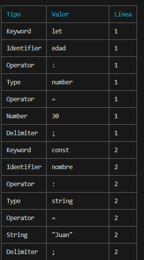
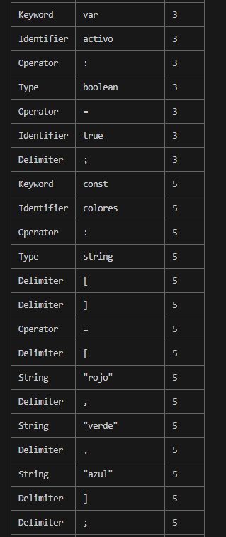
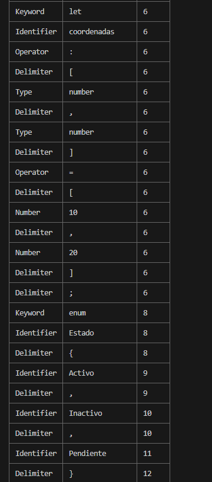
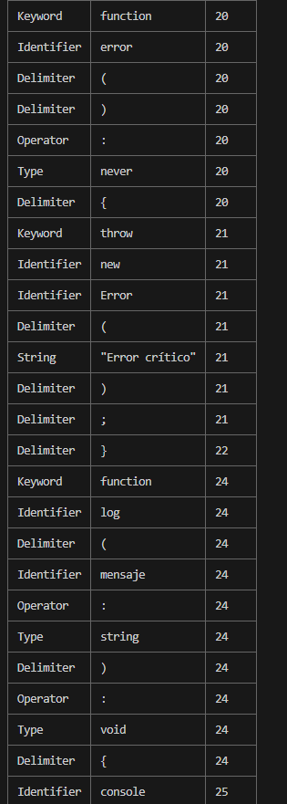
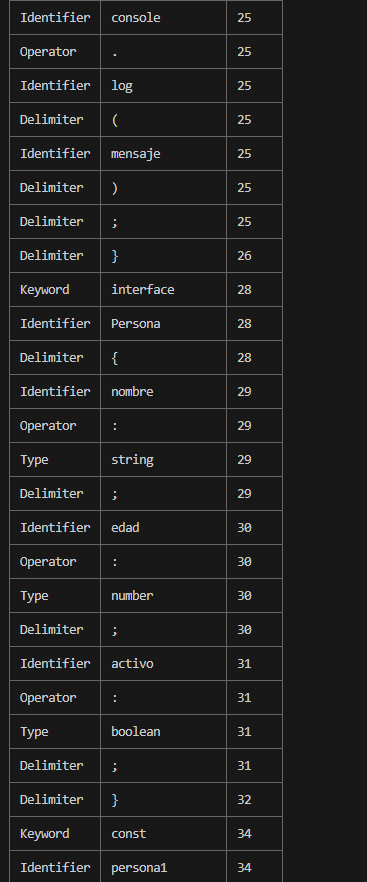
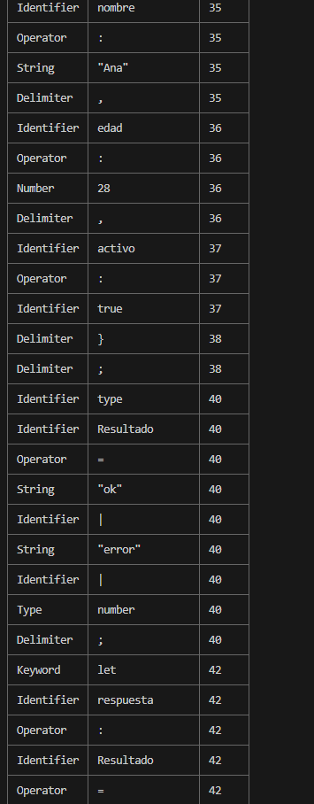
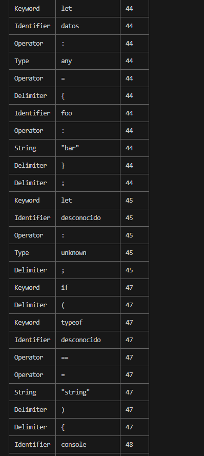
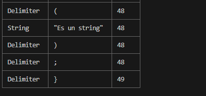

# Explicación del Código Paso a Paso

<table>
  <thead>
    <tr>
      <th>Paso</th>
      <th>Descripción</th>
      <th>Función o Método</th>
      <th>Fragmento de Código</th>
      <th>Captura / Resultado</th>
      <th>Observaciones</th>
    </tr>
  </thead>
  <tbody>
    <tr>
      <td>1</td>
      <td>Se importa el módulo <code>fs</code> para trabajar con archivos.</td>
      <td><code>require('fs')</code></td>
      <td><code>const fs = require('fs');</code></td>
      <td>-</td>
      <td>Es necesario para leer el archivo fuente.</td>
    </tr>
    <tr>
      <td>2</td>
      <td>Se intenta importar <code>cli-table3</code>. Si falla, se usa tabla básica.</td>
      <td><code>require('cli-table3')</code> con <code>try/catch</code></td>
      <td><code>let Table; let tieneCliTable = true; try { Table = require('cli-table3'); } catch (e) { ... }</code></td>
      <td>Advertencia si no está instalado</td>
      <td>Permite flexibilidad y mejora visual.</td>
    </tr>
    <tr>
      <td>3</td>
      <td>Obtiene el archivo desde los argumentos de la terminal.</td>
      <td><code>process.argv[2]</code></td>
      <td><code>const archivo = process.argv[2];</code></td>
      <td>Ej: codigofuente.ts</td>
      <td>Valida si se pasó un archivo.</td>
    </tr>
    <tr>
      <td>4</td>
      <td>Verifica si el archivo existe.</td>
      <td><code>fs.existsSync</code></td>
      <td><code>if (!fs.existsSync(archivo)) { ... }</code></td>
      <td>Mensaje de error</td>
      <td>Evita errores de lectura.</td>
    </tr>
    <tr>
      <td>5</td>
      <td>Lee y divide el contenido en líneas.</td>
      <td><code class="language-javascript">fs.readFileSync</code>, <code>split('\n')</code></td>
      <td><code class="language-javascript">const code = fs.readFileSync(...); const lines = code.split('\n');</code></td>
      <td>Arreglo de líneas</td>
      <td>Base para el análisis.</td>
    </tr>
    <tr>
      <td>6</td>
      <td>Define palabras clave, tipos, operadores y delimitadores.</td>
      <td>Arrays</td>
      <td>
<pre><code class="language-javascript">const keywords = ['let', 'const', 'var', 'function', ...];
const types = ['number', 'string', ...];
const operators = ['=', '+', '-', '*', '/', ...];
const delimiters = [';', ',', '(', ')', '{', '}'];</code></pre>
      </td>
      <td>-</td>
      <td>Para clasificar tokens.</td>
    </tr>
    <tr>
      <td>7</td>
      <td>Tokeniza con expresión regular.</td>
      <td><code>RegExp.match()</code></td>
      <td>
<pre><code>const regex = /"(.*?)"|...|[+\-*/%=!<>&|.:;,()[\]{}]/g;
const matches = line.match(regex);</code></pre>
      </td>
      <td>Tokens crudos</td>
      <td>Extrae componentes de la línea.</td>
    </tr>
    <tr>
      <td>8</td>
      <td>Clasifica los tokens según tipo.</td>
      <td><code>if/else</code></td>
      <td>
<pre><code>if (keywords.includes(token)) type = 'Keyword';
else if (types.includes(token)) type = 'Type';
else if (operators.includes(token)) type = 'Operator';
else if (delimiters.includes(token)) type = 'Delimiter';
else if (/^\d+(\.\d+)?$/.test(token)) type = 'Number';
else if (/^".*"$|^'.*'$/.test(token)) type = 'String';</code></pre>
      </td>
      <td>Tokens clasificados</td>
      <td>Detecta tipo de cada token.</td>
    </tr>
    <tr>
      <td>9</td>
      <td>Crea la tabla de símbolos con datos de variables.</td>
      <td><code>symbolTable.push</code></td>
      <td>
<pre><code>if (token === 'let' && matches[i + 1]) {
  symbolTable.push({...});
}</code></pre>
      </td>
      <td>-</td>
      <td>Guarda nombre, tipo, línea.</td>
    </tr>
    <tr>
      <td>10</td>
      <td>Detecta funciones, interfaces y enums.</td>
      <td>Condicionales similares</td>
      <td>
<pre><code>if (token === 'function') { symbolTable.push(...); }
if (token === 'interface') { symbolTable.push(...); }
if (token === 'enum') { symbolTable.push(...); }</code></pre>
      </td>
      <td>-</td>
      <td>Agrega estructuras a la tabla.</td>
    </tr>
    <tr>
      <td>11</td>
      <td>Muestra el resultado de tokens </td>
      <td><code>console.log</code> o <code>table.toString()</code></td>
      <td><code>if (tieneCliTable) {
    const tokenTable = new Table({ head: ['Tipo', 'Valor', 'Línea'], style: { head: ['cyan'] } });
    tokens.forEach(t => tokenTable.push([t.type, t.value, t.line]));
    console.log('\nTokens detectados:\n');
    console.log(tokenTable.toString());
} else {
    console.log('\nTokens detectados:\n');
    console.log('Tipo\t\tValor\t\tLínea');
    tokens.forEach(t => {
        const tType = t.type.padEnd(10);
        const tVal = t.value.padEnd(10);
        console.log(`${tType}\t${tVal}\t${t.line}`);
    });
}</code></td>
      <td>Tabla en consola</td>
      <td>Usa formato visual si está instalado.</td>
    </tr>
   <tr>
      <td>12</td>
      <td>Muestra los resultados simbolicos</td>
      <td><code>console.log</code> o <code>table.toString()</code></td>
      <td><code>if (tieneCliTable) {
    const tokenTable = new Table({ head: ['Tipo', 'Valor', 'Línea'], style: { head: ['cyan'] } });
    tokens.forEach(t => tokenTable.push([t.type, t.value, t.line]));
    console.log('\nTokens detectados:\n');
    console.log(tokenTable.toString());
} else {
    console.log('\nTokens detectados:\n');
    console.log('Tipo\t\tValor\t\tLínea');
    tokens.forEach(t => {
        const tType = t.type.padEnd(10);
        const tVal = t.value.padEnd(10);
        console.log(`${tType}\t${tVal}\t${t.line}`);
    });
}</code></td>
      <td>Tabla en consola</td>
      <td>Usa formato visual si está instalado.</td>
    </tr>
  </tbody>
</table>

### Capturas de Ejemplo

|  |  | 
|--------------------------|--------------------------|--------------------------|
|  |  | 
|  |  |